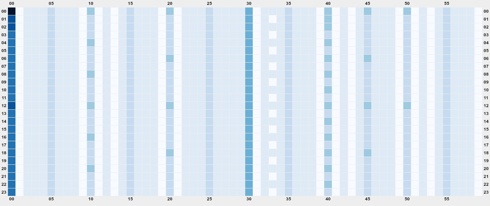
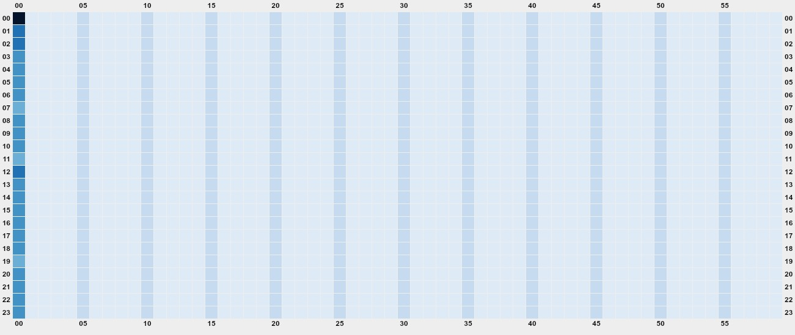
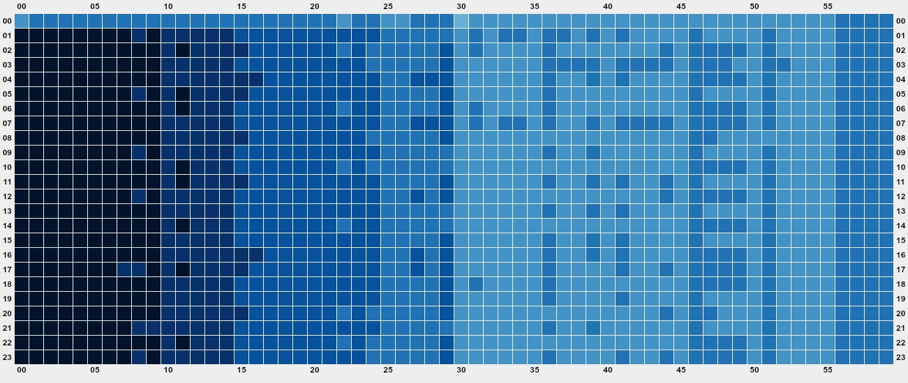
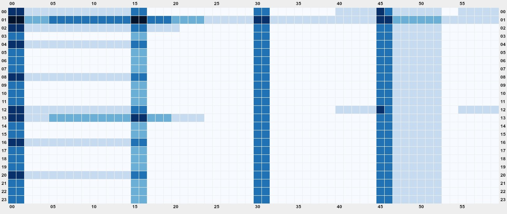
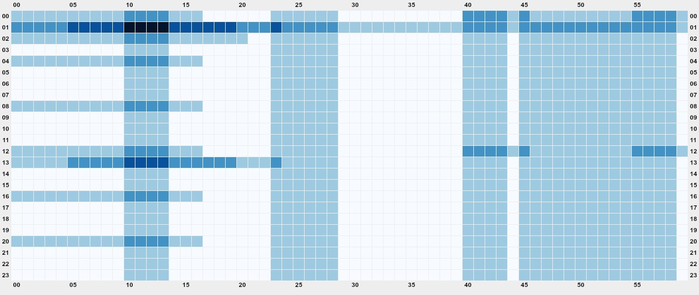
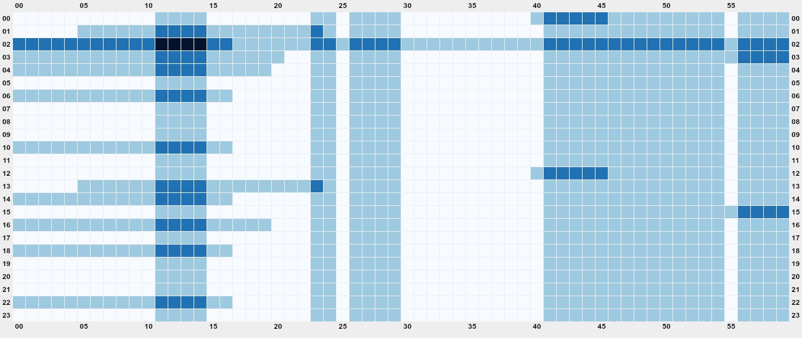

# Cron Ironer

[](https://www.npmjs.com/package/cron-ironer)


Cron Ironer parses cron schedules, renders 24-hour heatmaps as ASCII or JPEG, and can suggest evenly distributed alternatives.

## Installation

Requires Node.js 18 or later.

```bash
npm install -g cron-ironer
```

## Usage

```bash
cron-ironer <file> [options]

Options:
  --format <yaml|json|text>  Infer from extension by default
  --image                    Write JPEG heatmap (min 1300x550) instead of ASCII
  --suggest                  Enable schedule optimization
  --optimizer <offset|greedy>  Select optimizer when using --suggest (default: offset)
  --reflect-duration         Use job estimation (in seconds) when drawing heatmap
  -o, --out-file <path>      Write heatmap to file
```

### Examples

Sample inputs and outputs live in `test/resource`.

#### Suggesting evenly spaced schedules

Using `test/resource/test-1.json`:

```bash
npx cron-ironer test/resource/test-1.json --suggest
```

To try the greedy optimizer on the same workload and allow the tool to adjust hours, run:

```bash
npx cron-ironer test/resource/test-1.json --suggest --optimizer greedy
```

Input snippet:

```json
[
  { "name": "job_9f9bc96b", "schedule": "*/5 * * * *", "estimation": 29 },
  { "name": "job_a476d562", "schedule": "*/5 * * * *", "estimation": 50 },
  { "name": "job_7f2aacea", "schedule": "0 1 * * *", "estimation": 6365 },
  ...
]
```

Running the command produces:

- `test/resource/test-1.suggested.json` with optimized schedules
- `test/resource/test-1.before.suggested.jpg` and `test/resource/test-1.after.suggested.jpg` heatmaps

Output snippet (`test/resource/test-1.suggested.json`):

```json
[
  { "name": "job_9f9bc96b", "schedule": "4/5 * * * *", "estimation": 29 },
  { "name": "job_a476d562", "schedule": "3/5 * * * *", "estimation": 50 },
  { "name": "job_7f2aacea", "schedule": "0 1 * * *", "estimation": 6365 },
  ...
]
```

Heatmaps:

Before optimization, jobs cluster in a few dark bands (330 Cron Jobs):



After optimization, the schedule spreads jobs evenly across the day (330 Cron Jobs):



With the `greedy` optimizer, the schedule is more evenly distributed (330 Cron Jobs):



### Optimizer algorithms

`cron-ironer` provides two optimizers for the `--suggest` flow:

- **`offset`** (default) keeps the existing offsets grouped by cron interval and redistributes them evenly. It keeps the original start time for jobs that do not share an `*/n` minute pattern.
- **`greedy`** aggressively searches for the least crowded start time for every eligible schedule. Jobs are sorted from longest duration to shortest, with ties broken by the number of daily intervals. Jobs marked with `keepTime: true` are scheduled first and never moved. The greedy optimizer minimises overlap across the whole day, including runs that span midnight and shifts that roll into the next day.

> ⚠️ The greedy optimizer may change the start time (minute and hour) of your cron jobs while keeping their recurrence interval intact. Review the suggested cron expressions before applying them.

For example, a job defined as `10 */2 * * *` (10 minutes past every two hours) can be shifted to `33 1/2 * * *`, spreading the workload to the odd hours while keeping the two-hour cadence. Likewise, a daily job that originally ran at `0 18 * * *` can move to a quieter `13 19 * * *` slot when the evening window is saturated.

#### Keeping specific jobs pinned

You can mark a job with `keepTime: true` to prevent optimizers from shifting it. This is particularly helpful when a job must stay aligned with external systems. Estimation values are expressed in seconds:

```json
[
  {
    "name": "critical_sync",
    "schedule": "0/5 * * * *",
    "estimation": 600,
    "keepTime": true
  },
  { "name": "background_cleanup", "schedule": "*/5 * * * *", "estimation": 120 }
]
```

Running `npx cron-ironer schedule.json --suggest --optimizer greedy` keeps `critical_sync` at its current start minute and rearranges the other compatible jobs around it.

#### Reflecting job duration

The `--reflect-duration` flag weights each job by its `estimation` value when drawing the heatmap. Using `test/resource/test-2.json`:

```bash
npx cron-ironer test/resource/test-2.json --suggest --reflect-duration
```

Input snippet:

```json
[
  { "name": "job_bd7892a0", "schedule": "40 0 1 * *", "estimation": 8442 },
  { "name": "job_3c13a828", "schedule": "0 */2 * * *", "estimation": 304 },
  { "name": "job_d70d9e02", "schedule": "10,40 * * * *", "estimation": 1799 },
  ...
]
```

Running the command produces:

- `test/resource/test-4.suggested.json` with optimized schedules
- `test/resource/test-4.before.suggested.reflect.jpg` and `test/resource/test-4.after.suggested.reflect.jpg` weighted heatmaps

Weighted heatmaps:

Before optimization, long jobs create heavy bands (10 Cron Jobs):



After optimization, load spreads while respecting job length (10 Cron Jobs):



With the `greedy` optimizer, the schedule is more evenly distributed (10 Cron Jobs):



### Heatmap interpretation

- Image heatmaps start at 1300 x 550 pixels and expand as needed.
- The Y-axis shows hours (00-23); the X-axis lists minutes (00-59) in 5-minute increments.
- ASCII heatmaps dedicate two characters per minute and use shading characters (`█`, `▓`, `▒`, `░`) to indicate cron job density.

## License

MIT
